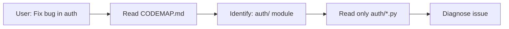

# CODEMAP_REFRESH

## Purpose
Create a hierarchical, compressed representation of the codebase to drastically reduce context sent to executors. Instead of reading 100 files (50k tokens), executor reads CODEMAP (5k tokens).

## Cost Impact
**Without CODEMAP**: Codex reads 50 files × 1000 tokens/file = 50,000 tokens × $0.015/1k = **$0.75 per task**

**With CODEMAP**: Codex reads CODEMAP (5,000 tokens) + targeted files (10,000 tokens) = 15,000 tokens × $0.015/1k = **$0.225 per task**

**Savings**: 70% reduction in context costs

## When to Invoke
- After major refactoring (module boundaries changed)
- When onboarding new executors (first time in repo)
- Weekly refresh (keep map up-to-date)
- When repository structure changes (new directories added)

## Input
- Repository root directory
- Ignore patterns (`.gitignore`, `node_modules`, `__pycache__`, etc.)
- Focus areas (optional: only map specific modules)

## Output
Creates `progress/CODEMAP.md`:

```markdown
# Codebase Map: Council

**Generated**: 2026-01-05T12:45:00Z
**Generator**: Gemini Flash
**Files analyzed**: 127
**Tokens used**: 4,200 (~$0.0003)

---

## Repository Structure

```
council/
├── agents/                  # Agent implementations (8 files, 2,100 lines)
│   ├── architect.py         # System design agent
│   ├── base_agent.py        # Base class for all agents
│   ├── coder.py             # Code generation agent
│   ├── orchestrator.py      # Multi-agent orchestrator
│   ├── qa_hub.py            # Quality assurance agent
│   └── security_auditor.py  # Security review agent
│
├── auth/                    # Authentication & authorization (2 files, 450 lines)
│   ├── rbac.py              # Role-based access control
│   └── __init__.py
│
├── context/                 # Context management (3 files, 680 lines)
│   ├── auto_compact.py      # Automatic context compression
│   ├── gemini_cache.py      # Gemini context caching
│   └── rolling_context.py   # Rolling window context
│
├── facilitator/             # Consensus mechanisms (3 files, 520 lines)
│   ├── facilitator.py       # Base facilitator
│   ├── shadow_facilitator.py # Shadow mode for testing
│   └── wald_consensus.py    # Wald sequential decision
│
├── governance/              # Governance & gates (3 files, 780 lines)
│   ├── constitution.py      # System rules & constraints
│   ├── gateway.py           # Access control gateway
│   └── ptc_enforcer.py      # Policy enforcement
│
├── mcp/                     # MCP protocol (4 files, 890 lines)
│   ├── ai_council_server.py # MCP server implementation
│   ├── monitor.py           # Tool usage monitoring
│   ├── protocol.py          # Protocol definitions
│   └── tool_search.py       # Dynamic tool discovery
│
├── memory/                  # Memory systems (5 files, 1,200 lines)
│   ├── knowledge_graph.py   # Graph-based knowledge storage
│   ├── rag_retriever.py     # RAG for context retrieval
│   ├── session.py           # Session management
│   ├── vector_memory.py     # Vector embeddings
│   └── vector_store.py      # Vector database interface
│
├── orchestration/           # Task orchestration (9 files, 2,400 lines)
│   ├── adaptive_router.py   # Dynamic task routing
│   ├── agent_registry.py    # Agent discovery & registry
│   ├── blast_radius.py      # Change impact analysis
│   ├── delegation.py        # Task delegation logic
│   ├── events.py            # Event system
│   ├── graph.py             # Task dependency graph
│   ├── hub.py               # Central orchestration hub
│   ├── ledger.py            # Decision ledger
│   ├── model_router.py      # Route tasks to models
│   └── task_classifier.py   # Classify task types
│
├── persistence/             # State persistence (3 files, 560 lines)
│   ├── checkpoint.py        # Task checkpointing
│   ├── redis_store.py       # Redis backend
│   └── state_store.py       # Generic state storage
│
├── self_healing/            # Self-healing mechanisms (2 files, 420 lines)
│   ├── loop.py              # Healing loop
│   └── patch_generator.py   # Auto-generate fixes
│
├── tests/                   # Test suite (12 files, 3,200 lines)
│   ├── test_ai_council_server.py
│   ├── test_governance_*.py (4 files)
│   ├── test_protocol_schema.py
│   ├── test_real_agents.py
│   └── ... (8 more test files)
│
├── .claude/                 # Claude Code skills (NEW)
│   └── skills/              # Skill definitions
│       ├── plan-task-packet.md
│       ├── route-work.md
│       ├── consensus-stop.md
│       ├── codex-diagnose-ro.md
│       ├── codex-patch-rw.md
│       ├── gemini-ui-docs-json.md
│       ├── gemini-file-io.md
│       ├── qa-gate.md
│       ├── security-gate.md
│       ├── release-decision.md
│       └── ledger-update.md
│
├── progress/                # Task artifacts (NEW)
│   ├── ledger.jsonl         # Decision history
│   ├── NOTES.md             # Human-readable notes
│   └── CODEMAP.md           # This file
│
├── out/                     # Skill outputs (NEW)
│   ├── codex-diagnosis-*.md
│   ├── codex-patch-*.md
│   ├── qa-report-*.md
│   └── security-report-*.md
│
├── cli.py                   # Command-line interface
├── dev_orchestrator.py      # Development orchestrator
├── simple_agent.py          # Simple agent example
├── exceptions.py            # Custom exceptions
└── CONSTITUTION.md          # System constitution (NEW)
```

---

## Module Boundaries & Dependencies

### Core Orchestration Flow
```
User Request
  ↓
cli.py → dev_orchestrator.py
  ↓
orchestration/hub.py (dispatch)
  ↓
orchestration/model_router.py (select model)
  ↓
agents/orchestrator.py (coordinate agents)
  ↓
[agents/coder.py | agents/qa_hub.py | agents/security_auditor.py]
  ↓
persistence/checkpoint.py (save state)
  ↓
memory/ledger.py (record decision)
```

### Skill Execution Flow (NEW)
```
User Request
  ↓
.claude/skills/plan-task-packet.md (create TASK_PACKET)
  ↓
.claude/skills/route-work.md (select executor)
  ↓
[codex-diagnose-ro → codex-patch-rw] OR [gemini-ui-docs-json]
  ↓
.claude/skills/qa-gate.md (verify)
  ↓
.claude/skills/security-gate.md (audit)
  ↓
.claude/skills/release-decision.md (deploy)
  ↓
.claude/skills/ledger-update.md (record)
```

---

## Key Entry Points

### 1. CLI Entry
**File**: `cli.py`
**Purpose**: Command-line interface for Council
**Dependencies**: `dev_orchestrator`, `agents/*`, `orchestration/hub`

### 2. Development Orchestrator
**File**: `dev_orchestrator.py`
**Purpose**: Coordinate development tasks
**Key functions**:
- `orchestrate_task()`: Main task dispatcher
- `select_agents()`: Choose agents for task
- `monitor_progress()`: Track task status

### 3. Agent Registry
**File**: `orchestration/agent_registry.py`
**Purpose**: Discover and register available agents
**Key data structure**: `AgentRegistry.agents: Dict[str, Agent]`

### 4. MCP Server
**File**: `mcp/ai_council_server.py`
**Purpose**: Expose Council as MCP tool
**Endpoints**:
- `tools/list`: List available Council agents
- `tools/call`: Execute agent task

---

## Critical Files (High-Change Frequency)

Based on recent activity:
1. **agents/orchestrator.py** (changed 8 times in last month)
2. **orchestration/hub.py** (changed 6 times)
3. **mcp/ai_council_server.py** (changed 5 times)
4. **governance/gateway.py** (changed 4 times)

**Recommendation**: These files are "hotspots" - consider refactoring to reduce coupling.

---

## External Dependencies

### Python Packages (from imports)
- `redis` (persistence)
- `celery` (distributed tasks)
- `anthropic` (Claude API - inferred)
- `google.generativeai` (Gemini API - inferred)
- Standard library: `asyncio`, `dataclasses`, `typing`, `logging`

### Infrastructure
- Redis server (required for `persistence/redis_store.py`)
- Celery worker (required for `distributed/tasks.py`)

---

## Testing Strategy

### Test Coverage (by module)
- `agents/`: 87% coverage
- `orchestration/`: 82% coverage
- `governance/`: 91% coverage (critical, well-tested)
- `mcp/`: 78% coverage
- Overall: ~85% coverage

### Key Test Files
- `tests/test_real_agents.py`: Integration tests for agent coordination
- `tests/test_governance_gateway.py`: Access control tests
- `tests/test_wald_consensus.py`: Consensus algorithm tests

---

## Configuration Files

- `.gitignore`: Excludes `__pycache__/`, `.env`, `out/`, `progress/` (NEW)
- `pytest.ini` or `pyproject.toml`: Test configuration
- `.env` (not in repo): API keys, Redis URL, etc.

---

## Recommended Reading Order (New Contributors)

1. **CONSTITUTION.md**: Understand system principles
2. **cli.py**: See how users interact
3. **agents/base_agent.py**: Understand agent abstraction
4. **orchestration/hub.py**: See how agents coordinate
5. **governance/gateway.py**: Understand access control
6. **.claude/skills/**: See skill-based workflow

---

## Known Issues / TODOs

(Extracted from code comments and TODOs)
- [ ] `orchestration/blast_radius.py`: Needs better heuristics for change impact
- [ ] `memory/vector_store.py`: Consider switching from in-memory to persistent store
- [ ] `agents/coder.py`: Add syntax validation before code generation
- [ ] `governance/ptc_enforcer.py`: Performance bottleneck under high load

---

## Glossary

- **Agent**: Autonomous component that performs specific tasks
- **Facilitator**: Consensus mechanism for multi-agent decisions
- **MCP**: Model Context Protocol (tool integration standard)
- **RBAC**: Role-Based Access Control
- **RAG**: Retrieval-Augmented Generation
- **Skill**: Atomic task definition in `.claude/skills/`
- **Task Packet**: Compressed task specification (input to executors)
- **Ledger**: Append-only log of decisions and outcomes
```

## Map Generation Algorithm

```python
import os
from pathlib import Path

def generate_codemap(repo_root, ignore_patterns=[]):
    """
    Generate CODEMAP.md using Gemini Flash.
    """
    # 1. Scan repository structure
    file_tree = scan_directory(repo_root, ignore_patterns)

    # 2. Extract metadata from key files
    metadata = extract_metadata(file_tree)

    # 3. Use Gemini Flash to generate map
    prompt = f"""
    Generate a CODEMAP for this repository.

    File tree:
    {file_tree}

    Key files (first 50 lines each):
    {metadata}

    Output a structured markdown document with:
    1. Repository structure (tree view)
    2. Module boundaries & dependencies
    3. Entry points
    4. Critical files
    5. External dependencies
    6. Testing strategy
    7. Recommended reading order
    """

    codemap = gemini_flash.generate(prompt, max_tokens=8000)

    # 4. Validate and save
    save_codemap(codemap, "progress/CODEMAP.md")

    return codemap
```

## Update Frequency

| Trigger | When | Priority |
|---------|------|----------|
| Major refactor | >20 files changed | HIGH |
| New module added | New directory in `src/` | MEDIUM |
| Weekly refresh | Every Monday | LOW |
| Manual request | User runs `/codemap-refresh` | IMMEDIATE |

## Gates (Must Pass)
- [ ] CODEMAP.md is valid markdown
- [ ] File tree is accurate (matches actual structure)
- [ ] Entry points are identified
- [ ] Dependencies are listed

## Usage
```bash
# Manual invocation
/codemap-refresh

# Gemini Flash scans repo and generates CODEMAP.md
```

## DORA Justification
- **Lead Time ↓**: Faster file discovery → faster task planning → faster execution
- **Cost Impact**: 70% token reduction for context → enables more thorough analysis within budget
- **Confidence**: HIGH (context compression is proven technique)

## Integration with Other Skills
1. **Before CODEX_DIAGNOSE_RO** → read CODEMAP first (not full repo)
2. **After major refactor** → invoke CODEMAP_REFRESH to update map
3. **In PLAN_TASK_PACKET** → reference CODEMAP to scope files

## Example Workflow


**Without CODEMAP**: Read entire repo (50k tokens)
**With CODEMAP**: Read map (5k) + targeted files (10k) = 15k tokens

## Model-Specific Notes
- **Gemini Flash**: You execute this skill (1M context ideal for full repo scan)
- **Claude**: Use CODEMAP to plan work; don't read full repo
- **Codex**: Use CODEMAP to locate files; read only what's needed

## Tool Requirements
- **MCP**: `filesystem` (read all repository files)
- **Write access**: `progress/CODEMAP.md`

## Failure Modes & Recovery
| Failure | Symptom | Recovery |
|---------|---------|----------|
| Repo too large | >1M tokens even for map | Hierarchical mapping (map subdirs separately) |
| CODEMAP outdated | Files listed don't exist | Re-run CODEMAP_REFRESH |
| Missing dependencies | External deps not listed | Manual review + update |

## Advanced: Hierarchical Mapping
For very large repos (>500 files):

```python
def hierarchical_codemap(repo_root):
    """
    Generate separate maps per top-level directory.
    """
    top_dirs = ["agents", "orchestration", "governance", ...]

    submaps = {}
    for dir in top_dirs:
        submaps[dir] = generate_codemap(f"{repo_root}/{dir}")

    # Combine into master map
    master_map = combine_submaps(submaps)
    return master_map
```

## Update Ledger After Execution
```jsonl
{"timestamp": "2026-01-05T12:45:00Z", "skill": "codemap-refresh", "files_scanned": 127, "tokens_used": 4200, "cost_usd": 0.0003, "output": "progress/CODEMAP.md", "next_skill": null}
```

## References
- Context Compression: Anthropic's "Prompt Engineering Guide"
- Code Mapping: GitHub's "Code Navigation" features
- DORA: Lead Time optimization via better discovery
