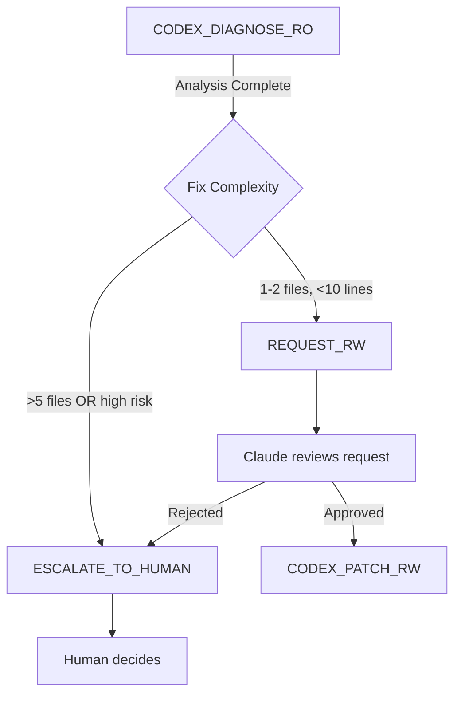

# CODEX_DIAGNOSE_RO

## Purpose
Read-only diagnostic phase before any code changes. Codex analyzes failures, logs, and existing code to identify root cause and minimal fix points WITHOUT writing anything.

## Input
- `progress/TASK_PACKET.md` (required)
- `progress/ROUTE_DECISION.md` (must show codex-ro permission)
- Relevant files (from TASK_PACKET.in_scope)
- Failure logs / error messages

## Output
Creates `out/codex-diagnosis-YYYYMMDD-HHMMSS.md`:

```markdown
# Diagnosis Report: [Task Title]

**Timestamp**: 2026-01-05T10:50:00Z
**Executor**: Codex (Read-Only Mode)
**Task Packet**: progress/TASK_PACKET.md

---

## ROOT CAUSE ANALYSIS

### Primary Issue
[One-sentence summary]

### Evidence
1. **File**: `path/to/file.py:123`
   - **Observation**: [What's wrong]
   - **Impact**: [Why it causes the bug]

2. **File**: `path/to/another.py:45`
   - **Observation**: [What's wrong]
   - **Impact**: [Why it contributes]

### Dependency Chain
```
User Request
  ↓
Component A (auth/middleware.py:78)
  ↓
Component B (auth/redis_pool.py:12) ← ROOT CAUSE HERE
  ↓
Failure (TimeoutError)
```

---

## MINIMAL FIX POINTS

### Option 1: Increase Redis Pool Size (Recommended)
- **Files to change**: `auth/redis_pool.py` (1 file, 1 line)
- **Change**: `pool_size=10` → `pool_size=50`
- **Risk**: LOW (backward compatible; no API change)
- **Verification**: `pytest tests/test_auth_redis.py -v`

### Option 2: Add Connection Timeout
- **Files to change**: `auth/redis_pool.py` (1 file, 3 lines)
- **Change**: Add `socket_timeout=5` parameter
- **Risk**: MEDIUM (might break long-running operations)
- **Verification**: `pytest tests/ -k redis -v`

### Option 3: Refactor to Async Pool (NOT RECOMMENDED)
- **Files to change**: 8 files across auth/ and api/
- **Risk**: HIGH (large blast radius; not minimal)
- **Rationale**: Violates "smallest reversible change" principle

---

## RECOMMENDATION
**Execute Option 1** (increase pool size)

**Confidence**: HIGH
- Simple change (1 line)
- Well-tested pattern (Redis pool sizing)
- Easy rollback (revert 1 line)

If Option 1 fails verification → re-diagnose before trying Option 2.

---

## VERIFICATION PLAN
```bash
# 1. Run existing tests
pytest tests/test_auth_redis.py -v

# 2. Simulate high load
python scripts/load_test_auth.py --requests 1000 --concurrent 50

# 3. Check Redis metrics
redis-cli INFO stats | grep -E 'total_connections|blocked_clients'
```

**Expected outcome**:
- All tests pass
- Load test completes without timeouts
- `blocked_clients=0` in Redis metrics

---

## ESCALATION CRITERIA
Escalate to human if:
- [ ] Verification fails after applying Option 1
- [ ] Root cause is actually in external service (not our code)
- [ ] Fix requires changing database schema

---

## PERMISSION REQUEST
**[NONE | REQUEST_RW]**

If REQUEST_RW:
- **Justification**: Root cause identified; fix is minimal (1 line); verification plan ready
- **Files needing write access**: `auth/redis_pool.py`
- **Estimated risk**: LOW
```

## Permission Escalation Flow


## Gates (Must Pass)
- [ ] ROOT CAUSE is specific (not vague like "performance issue")
- [ ] Evidence includes file paths + line numbers
- [ ] MINIMAL FIX POINTS has ≥2 options (show alternatives)
- [ ] VERIFICATION PLAN has copy-pasteable commands
- [ ] RECOMMENDATION explains why (not just "do this")

## Usage
```bash
# After ROUTE_WORK selects codex-ro
/codex-diagnose-ro

# Codex reads files, analyzes, produces diagnosis report
# NO writes to repository (only to out/ directory)
```

## DORA Justification
- **Change Failure Rate ↓**: Diagnosis before patching reduces "fix the fix" cycles
- **Lead Time ↓**: Clear root cause → faster path to solution
- **Confidence**: HIGH (SRE best practice: always diagnose before acting)

## Integration with Other Skills
1. **After ROUTE_WORK** → if routed to codex-ro, invoke this skill
2. **Before CODEX_PATCH_RW** → diagnosis report must exist (abort if missing)
3. **If escalating** → diagnosis becomes input to HUMAN_REVIEW_REQUIRED.md

## Model-Specific Notes
- **Codex**: You execute this skill; be ruthlessly minimal in fix recommendations
- **Claude**: Review diagnosis; approve/reject RW request based on risk
- **Gemini**: Not involved (you don't do diagnosis)

## Tool Requirements
- **MCP**: None (pure file reading via standard tools)
- **Read access**: Files from TASK_PACKET.in_scope
- **Write access**: `out/` directory only (NOT repository files)

## Failure Modes & Recovery
| Failure | Symptom | Recovery |
|---------|---------|----------|
| Can't identify root cause | Vague diagnosis | Escalate to human with "insufficient information" |
| Multiple equally likely causes | Diagnosis lists 4+ options | Run targeted experiments (add logging); re-diagnose |
| Root cause is external | "Bug is in Redis server" | Document findings; escalate (no code fix possible) |

## Example Output (Good)
```markdown
# Diagnosis Report: Auth Timeout Bug

## ROOT CAUSE ANALYSIS
### Primary Issue
Redis connection pool exhausted under load (10 connections insufficient for 50 concurrent users).

### Evidence
1. **File**: `auth/redis_pool.py:12`
   - **Observation**: `pool_size=10` hardcoded
   - **Impact**: 11th connection blocks until one frees

2. **Logs**: `auth.log`
   - **Observation**: `ConnectionPoolTimeout` at peak traffic
   - **Impact**: User sees "500 Internal Server Error"

## MINIMAL FIX POINTS
### Option 1: Increase pool to 50 (Recommended)
- **Change**: Line 12: `pool_size=10` → `pool_size=50`
- **Risk**: LOW
- **Verification**: `pytest tests/test_auth_redis.py -v`

## RECOMMENDATION
Execute Option 1. High confidence (this is textbook Redis pool exhaustion).

## PERMISSION REQUEST
REQUEST_RW for `auth/redis_pool.py`
```

## Anti-Patterns to Reject
❌ "The code looks fine; maybe it's a server issue" (no specific root cause)
❌ Recommending refactors instead of minimal fixes
❌ Verification plan without actual commands
❌ Requesting RW for >5 files (that's not minimal)

## Update Ledger After Execution
```json
{
  "skill": "codex-diagnose-ro",
  "timestamp": "2026-01-05T10:55:00Z",
  "input": "progress/TASK_PACKET.md",
  "output": "out/codex-diagnosis-20260105-105500.md",
  "root_cause_found": true,
  "rw_requested": true,
  "files_requested": ["auth/redis_pool.py"],
  "confidence": "high",
  "next_skill": "codex-patch-rw"
}
```

## Advanced: Using Gemini Flash for File I/O
For large codebases (>100 files), use Gemini Flash to:
1. **Read files efficiently**: Flash's 1M context can hold entire modules
2. **Generate file summaries**: Create CODEMAP.md for future diagnoses

```python
# Pseudo-code for delegating file reads to Gemini Flash
def diagnose_with_gemini_assist(task_packet):
    """
    Use Gemini Flash for cheap file reading; Codex for diagnosis logic.
    """
    # Step 1: Gemini Flash reads all in-scope files
    file_contents = gemini_flash.read_files(task_packet.in_scope_files)

    # Step 2: Gemini Flash creates structured summary
    summary = gemini_flash.summarize(
        prompt="Extract: imports, key functions, error handling patterns",
        files=file_contents
    )

    # Step 3: Codex uses summary (not raw files) for diagnosis
    diagnosis = codex.diagnose(summary)

    return diagnosis
```

**Cost savings**: Gemini Flash is ~10x cheaper than Codex for file reading; save Codex tokens for actual analysis.

## References
- Google SRE Book: "Postmortem Culture" (root cause analysis)
- DORA Metrics: Change Failure Rate definition
- Redis Best Practices: Connection pool sizing
