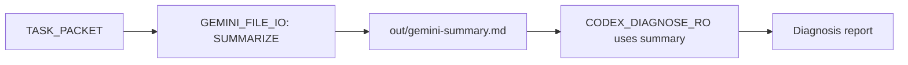
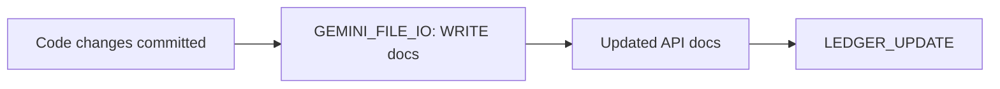

# GEMINI_FILE_IO

## Purpose
Leverage Gemini Flash's 1M context window and low cost ($0.075/1M tokens) for bulk file operations. Use this instead of expensive models for:
- Reading large codebases (>50 files)
- Generating file summaries
- Batch file writes (documentation, configs)

## Input
- `progress/TASK_PACKET.md` (optional; for context)
- Operation type: READ | WRITE | SUMMARIZE
- File list OR directory pattern

## Output Format

### For READ operations
Creates `out/gemini-files-YYYYMMDD-HHMMSS.json`:
```json
{
  "operation": "READ",
  "timestamp": "2026-01-05T11:00:00Z",
  "files": [
    {
      "path": "auth/middleware.py",
      "size_bytes": 3420,
      "content": "...",
      "encoding": "utf-8",
      "hash": "sha256:abc123..."
    }
  ],
  "total_files": 42,
  "total_bytes": 156789,
  "tokens_used": 52000
}
```

### For SUMMARIZE operations
Creates `out/gemini-summary-YYYYMMDD-HHMMSS.md`:
```markdown
# Codebase Summary: [Module/Directory]

**Generated**: 2026-01-05T11:00:00Z
**Files analyzed**: 42
**Tokens used**: 52,000 (~$0.004)

---

## Module Structure
```
auth/
├── middleware.py (Authentication middleware, 120 lines)
├── redis_pool.py (Redis connection pooling, 45 lines)
├── jwt.py (JWT token handling, 89 lines)
└── models.py (User/Session models, 156 lines)
```

## Key Components

### Authentication Flow
1. **Entry point**: `middleware.py:authenticate_request()`
2. **Token validation**: `jwt.py:verify_token()`
3. **Session lookup**: `redis_pool.py:get_session()`

### Dependencies
- External: `redis`, `pyjwt`, `bcrypt`
- Internal: `context.rolling_context`, `governance.rbac`

### Error Handling Patterns
- Custom exceptions: `AuthenticationError`, `SessionExpiredError`
- Retry logic: `redis_pool.py` (3 retries with exponential backoff)

### Testing Coverage
- Unit tests: `tests/test_auth.py` (87% coverage)
- Integration tests: `tests/test_auth_integration.py`

## Recommended Reading Order (for new contributors)
1. `models.py` (understand data structures)
2. `middleware.py` (understand request flow)
3. `jwt.py` (understand token mechanics)
4. `redis_pool.py` (understand session storage)
```

### For WRITE operations
Creates `out/gemini-write-report-YYYYMMDD-HHMMSS.json`:
```json
{
  "operation": "WRITE",
  "timestamp": "2026-01-05T11:00:00Z",
  "files_written": [
    {
      "path": "docs/api/auth.md",
      "size_bytes": 5420,
      "backup_path": "out/backups/auth.md.20260105-110000",
      "hash": "sha256:def456..."
    }
  ],
  "success": true,
  "verification": "All files written and verified"
}
```

## Usage Examples

### Example 1: Read Entire Module
```bash
/gemini-file-io --operation READ --pattern "auth/**/*.py"
```

**Output**: JSON with all Python files in `auth/` directory

**Cost**: ~50,000 tokens = $0.00375 (vs ~$0.06 with Codex)

### Example 2: Summarize Codebase for New Task
```bash
# Before starting a task, get high-level overview
/gemini-file-io --operation SUMMARIZE --pattern "auth/**/*.py" --focus "authentication flow, error handling, dependencies"
```

**Output**: Structured markdown summary

**Use case**: Feed summary to Codex (instead of raw files) for diagnosis → save tokens

### Example 3: Batch Write Documentation
```bash
/gemini-file-io --operation WRITE --input "progress/doc-plan.json"
```

**Input format** (`progress/doc-plan.json`):
```json
{
  "files": [
    {
      "path": "docs/api/auth.md",
      "content": "# Auth API\n\n..."
    },
    {
      "path": "docs/api/users.md",
      "content": "# Users API\n\n..."
    }
  ]
}
```

**Safety**: Creates backups in `out/backups/` before writing

## Gates (Must Pass)
- [ ] For READ: Pattern matches ≥1 file (abort if 0 matches)
- [ ] For WRITE: Backup created before overwriting existing files
- [ ] For SUMMARIZE: Output is valid markdown with structure (not just text dump)
- [ ] Token usage logged (for cost tracking)

## DORA Justification
- **Lead Time ↓**: Faster file analysis → faster diagnosis → faster fixes
- **Cost Impact**: 10x cheaper than Codex for I/O → enables more thorough analysis within budget
- **Confidence**: HIGH (Gemini Flash benchmarks show parity with larger models on summarization tasks)

## Integration with Other Skills

### Use BEFORE CODEX_DIAGNOSE_RO


**Benefit**: Codex sees compressed summary (5k tokens) instead of raw files (50k tokens) → 10x token savings

### Use AFTER CODEX_PATCH_RW


**Benefit**: Automate documentation updates without burning expensive model tokens

## Model-Specific Notes
- **Gemini Flash**: You execute this skill; optimize for throughput (batch operations)
- **Codex**: Consume Gemini's summaries; don't read raw files if summary exists
- **Claude**: Use this skill to prepare context before routing to Codex

## Tool Requirements
- **MCP**: `filesystem` (read/write files)
- **Permissions**: Read all repository files; write only to `out/` and `docs/` (not source code)

## Failure Modes & Recovery
| Failure | Symptom | Recovery |
|---------|---------|----------|
| File pattern matches 0 files | Empty result | Return error; ask user to check pattern |
| Encoding error (non-UTF8) | UnicodeDecodeError | Try binary mode; flag file as "needs manual review" |
| Summary too long (>10k tokens) | Output exceeds limit | Hierarchical summarization (summarize by subdirectory, then roll up) |
| Write fails (permissions) | IOError | Abort; escalate to human |

## Cost Tracking
Log every operation to `progress/gemini-cost-log.jsonl`:
```jsonl
{"timestamp": "2026-01-05T11:00:00Z", "operation": "READ", "tokens": 52000, "cost_usd": 0.0039}
{"timestamp": "2026-01-05T11:15:00Z", "operation": "SUMMARIZE", "tokens": 73000, "cost_usd": 0.0055}
```

**Monthly report**:
```bash
cat progress/gemini-cost-log.jsonl | jq -s 'map(.cost_usd) | add'
# Output: 0.42 USD (total Gemini Flash spend this month)
```

## Advanced: Hierarchical Summarization
For codebases >1M tokens (exceeds even Gemini's context):

```python
def hierarchical_summarize(directory):
    """
    1. Summarize each subdirectory separately
    2. Combine subdirectory summaries into top-level summary
    """
    subdirs = list_subdirectories(directory)
    subsummaries = []

    for subdir in subdirs:
        files = glob(f"{subdir}/**/*.py")
        summary = gemini_flash.summarize(files, max_tokens=5000)
        subsummaries.append({
            "subdir": subdir,
            "summary": summary
        })

    # Roll up
    final_summary = gemini_flash.combine_summaries(subsummaries)
    return final_summary
```

**Example**: For 500-file repo:
1. Summarize `auth/` → 5k tokens
2. Summarize `api/` → 5k tokens
3. Summarize `frontend/` → 5k tokens
4. Combine → 15k tokens (final summary)

**Total cost**: ~$0.01 (vs ~$1.50 with Codex)

## Security Considerations
- **No external file access**: Only read/write within repository
- **Backup before write**: Always create timestamped backup in `out/backups/`
- **No secrets in summaries**: Strip API keys, passwords before summarizing (use regex patterns)

## Update Ledger After Execution
```json
{
  "skill": "gemini-file-io",
  "timestamp": "2026-01-05T11:00:00Z",
  "operation": "SUMMARIZE",
  "input": "auth/**/*.py (42 files)",
  "output": "out/gemini-summary-20260105-110000.md",
  "tokens_used": 52000,
  "cost_usd": 0.0039,
  "next_skill": "codex-diagnose-ro"
}
```

## Comparison: Gemini Flash vs Codex for File I/O

| Task | Gemini Flash | Codex | Winner |
|------|--------------|-------|--------|
| Read 100 files | $0.01 | $0.15 | Flash (15x cheaper) |
| Summarize module | $0.005 | $0.08 | Flash (16x cheaper) |
| Write 10 docs | $0.002 | $0.03 | Flash (15x cheaper) |
| Code diagnosis | N/A | $0.10 | Codex (Flash not trained for this) |
| Code generation | N/A | $0.12 | Codex (Flash not trained for this) |

**Strategy**: Use Flash for I/O, Codex for logic

## Environment Variables
```bash
# .env
GEMINI_FLASH_API_KEY=your-key-here
GEMINI_FLASH_MAX_TOKENS=1000000  # 1M context limit
GEMINI_FILE_IO_BACKUP_DIR=out/backups
GEMINI_COST_LOG=progress/gemini-cost-log.jsonl
```

## References
- Gemini Flash pricing: https://ai.google.dev/pricing
- Context window: 1M tokens (input), 8k tokens (output)
- Latency: ~2s for 100k token input (vs ~15s for Opus)
