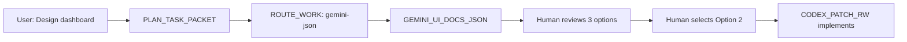

# GEMINI_UI_DOCS_JSON

## Purpose
Leverage Gemini's multimodal and long-context capabilities for:
- UI/UX design exploration (multiple options)
- Documentation generation
- Information architecture planning
- Design system analysis

**Key constraint**: Output MUST be valid JSON for downstream processing.

## When to Use
- User asks for "design options" or "explore UI layouts"
- Documentation needs to be generated from code
- Information architecture decisions (e.g., navigation structure)
- Component API design (before coding)

**When NOT to use**: Code implementation (use CODEX_PATCH_RW instead)

## Input
- `progress/TASK_PACKET.md` (optional; for context)
- Design constraints (brand colors, component library, etc.)
- Existing UI components (for consistency)

## Output
Creates `out/gemini-design-YYYYMMDD-HHMMSS.json`:

```json
{
  "task": "Dashboard Layout Options",
  "timestamp": "2026-01-05T11:30:00Z",
  "model": "gemini-1.5-pro",
  "tokens_used": 15420,
  "options": [
    {
      "id": "option-1",
      "title": "Sidebar Navigation with Cards",
      "description": "Traditional sidebar layout with card-based content areas",
      "pros": [
        "Familiar pattern for users",
        "Good for desktop",
        "Easy to implement with existing components"
      ],
      "cons": [
        "Less mobile-friendly",
        "Sidebar takes fixed width"
      ],
      "complexity": "LOW",
      "implementation_estimate": "2-3 hours",
      "components_needed": [
        "Sidebar",
        "Card",
        "Grid"
      ],
      "mockup_description": "Left sidebar (240px) with navigation items. Main area has 3-column grid of cards showing metrics.",
      "accessibility_score": 8,
      "responsive_score": 6
    },
    {
      "id": "option-2",
      "title": "Top Navigation with Tabs",
      "description": "Horizontal top nav with tabbed content areas",
      "pros": [
        "More screen space for content",
        "Better for mobile (collapsible tabs)",
        "Modern feel"
      ],
      "cons": [
        "Tabs can get crowded with many sections",
        "Requires new TabNav component"
      ],
      "complexity": "MEDIUM",
      "implementation_estimate": "4-5 hours",
      "components_needed": [
        "TabNav (new)",
        "Card",
        "Flexbox"
      ],
      "mockup_description": "Top navigation bar with 5 tabs. Active tab shows full-width content area.",
      "accessibility_score": 7,
      "responsive_score": 9
    },
    {
      "id": "option-3",
      "title": "Dashboard with Widget System",
      "description": "Draggable widgets that users can customize",
      "pros": [
        "Highly customizable",
        "Power user friendly",
        "Impressive UX"
      ],
      "cons": [
        "Complex implementation",
        "Requires state persistence",
        "Overkill for simple use case"
      ],
      "complexity": "HIGH",
      "implementation_estimate": "8-10 hours",
      "components_needed": [
        "DraggableGrid (new)",
        "Widget (new)",
        "LocalStorage integration"
      ],
      "mockup_description": "Grid of draggable widgets. User can resize and reorder.",
      "accessibility_score": 5,
      "responsive_score": 4
    }
  ],
  "recommendation": {
    "selected_option_id": "option-2",
    "rationale": "Best balance of modern UX and implementation complexity. Mobile-friendly (high responsive score) and doesn't require database changes. Option 1 is too traditional; Option 3 is over-engineered for current needs.",
    "next_steps": [
      "Human reviews and selects option",
      "Create TabNav component (or find existing in library)",
      "Implement with CODEX_PATCH_RW"
    ]
  },
  "design_tokens_used": {
    "colors": ["primary-blue", "neutral-gray-100", "neutral-gray-800"],
    "spacing": ["spacing-4", "spacing-8"],
    "typography": ["heading-2", "body-regular"]
  }
}
```

## JSON Schema (Enforced)
```json
{
  "type": "object",
  "required": ["task", "timestamp", "options", "recommendation"],
  "properties": {
    "task": {"type": "string"},
    "timestamp": {"type": "string", "format": "date-time"},
    "options": {
      "type": "array",
      "minItems": 2,
      "maxItems": 4,
      "items": {
        "type": "object",
        "required": ["id", "title", "description", "pros", "cons", "complexity"],
        "properties": {
          "id": {"type": "string"},
          "title": {"type": "string"},
          "description": {"type": "string"},
          "pros": {"type": "array", "items": {"type": "string"}},
          "cons": {"type": "array", "items": {"type": "string"}},
          "complexity": {"enum": ["LOW", "MEDIUM", "HIGH"]}
        }
      }
    },
    "recommendation": {
      "type": "object",
      "required": ["selected_option_id", "rationale"],
      "properties": {
        "selected_option_id": {"type": "string"},
        "rationale": {"type": "string"}
      }
    }
  }
}
```

## Validation (Hard Gate)
Before saving output:
```python
import json
import jsonschema

def validate_gemini_output(output_file):
    """Validate JSON output against schema."""
    with open(output_file) as f:
        data = json.load(f)

    jsonschema.validate(data, SCHEMA)  # Raises if invalid

    # Additional checks
    assert len(data["options"]) >= 2, "Must provide at least 2 options"
    assert data["recommendation"]["selected_option_id"] in [o["id"] for o in data["options"]], "Invalid recommendation"

    return True  # Validation passed
```

**If validation fails → retry once; if still fails → escalate to human**

## Gates (Must Pass)
- [ ] Output is valid JSON (parseable)
- [ ] Schema validation passes
- [ ] At least 2 options provided
- [ ] Recommendation references a valid option
- [ ] Pros/cons are non-empty for each option

## Usage
```bash
# Manual invocation only (disabled from auto-model-invocation)
/gemini-ui-docs-json

# Gemini explores options and outputs JSON
```

## DORA Justification
- **Lead Time ↓**: Explore design space before coding → avoid "build the wrong thing"
- **Change Failure Rate ↓**: Human reviews options → select best before implementation
- **Confidence**: MEDIUM-HIGH (design exploration is valuable but doesn't directly prevent bugs)

## Integration with Other Skills
1. **After PLAN_TASK_PACKET** (if task is UI/UX focused) → invoke this skill
2. **After GEMINI_UI_DOCS_JSON** → human reviews JSON → selects option
3. **After human selection** → invoke CODEX_PATCH_RW with selected option as input

## Example Workflow


## Model-Specific Notes
- **Gemini**: You execute this skill; always output valid JSON
- **Claude**: Route UI/design tasks to Gemini; consume JSON output for decision-making
- **Codex**: Not involved in design exploration

## Tool Requirements
- **MCP**: None (pure design work)
- **Read access**: Design system files (if available)
- **Write access**: `out/` directory only

## Failure Modes & Recovery
| Failure | Symptom | Recovery |
|---------|---------|----------|
| Invalid JSON | Parse error | Retry with explicit JSON format instruction |
| Schema violation | Missing required fields | Retry with schema in prompt |
| Only 1 option | Not exploring design space | Reject; require at least 2 options |
| Recommendation missing | No "recommended" field | Default to first option; warn human |

## Example: Documentation Generation
```json
{
  "task": "Generate API Documentation for Auth Module",
  "timestamp": "2026-01-05T11:40:00Z",
  "sections": [
    {
      "title": "Authentication",
      "endpoints": [
        {
          "method": "POST",
          "path": "/api/auth/login",
          "description": "Authenticate user and return JWT token",
          "request_body": {
            "username": "string (required)",
            "password": "string (required)"
          },
          "responses": {
            "200": "Success - returns {token: string, expires_at: datetime}",
            "401": "Invalid credentials",
            "429": "Rate limit exceeded"
          },
          "example": "curl -X POST ... (see full example)"
        }
      ]
    }
  ],
  "recommendation": {
    "format": "OpenAPI 3.0 YAML",
    "rationale": "Standard format; can generate interactive docs with Swagger UI"
  }
}
```

## Advanced: Multimodal Input
If user provides screenshot or mockup:

```python
def gemini_analyze_screenshot(image_path, task):
    """
    Gemini can analyze existing UI screenshots.
    """
    prompt = f"""
    Analyze this UI screenshot for task: {task}

    Provide JSON output with:
    - Identified components
    - Layout structure
    - Color palette
    - Suggested improvements
    """

    response = gemini.generate(prompt, image=image_path)
    return validate_json(response)
```

## Cost Optimization
- Use Gemini Flash for simple docs (10x cheaper)
- Use Gemini Pro for complex UI analysis (better multimodal)

**Pricing**:
- Gemini Flash: $0.075/1M input tokens
- Gemini Pro: $1.25/1M input tokens

**Rule of thumb**: Use Flash unless task involves image analysis or >100k context

## Update Ledger After Execution
```json
{
  "skill": "gemini-ui-docs-json",
  "timestamp": "2026-01-05T11:30:00Z",
  "input": "progress/TASK_PACKET.md (Dashboard design)",
  "output": "out/gemini-design-20260105-113000.json",
  "options_generated": 3,
  "recommendation": "option-2 (Top Navigation with Tabs)",
  "validation_passed": true,
  "human_review_required": true,
  "next_skill": "awaiting-human-selection"
}
```

## References
- Gemini API: https://ai.google.dev/docs
- JSON Schema: https://json-schema.org/
- Design Tokens: https://designtokens.org/
