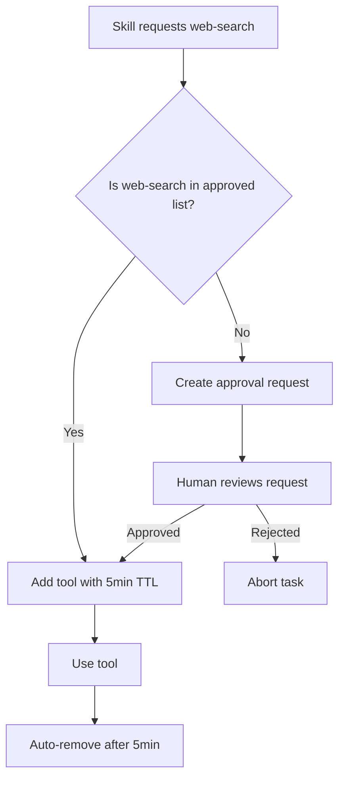

# MCP Management Guide for Council Skills

## Overview

Model Context Protocol (MCP) allows skills to dynamically load external tools **only when needed**, then remove them after use. This prevents:
- Context bloat (too many tools in prompt)
- Security risks (minimize attack surface)
- Token waste (only pay for tools you use)

## Core Principle

> **Default: NO TOOLS. Explicit Enable. Explicit Disable.**

Every MCP tool must justify its existence for each task and be removed immediately after completion.

---

## MCP Lifecycle

### 1. Before Task: Enable Required Tools

```bash
# Check current MCP servers
claude mcp list

# Add tool for this specific task
claude mcp add <server-name> --scope local

# Verify tool is available
claude mcp list | grep <server-name>
```

### 2. During Task: Use Tool

```python
# In skill execution
result = use_mcp_tool("tool_name", args)
```

### 3. After Task: Remove Tool

```bash
# Remove tool from this session
claude mcp remove <server-name>

# Verify removal
claude mcp list  # Should not show removed tool
```

---

## MCP Scopes

| Scope | Persistence | Use Case |
|-------|-------------|----------|
| `local` | Current session only | Task-specific tools (Redis, external APIs) |
| `project` | All sessions in this repo | Shared tools (filesystem, git) |
| `user` | All sessions globally | Personal tools (your own MCP servers) |

**Recommendation**: Use `local` scope by default for security.

---

## Common MCP Tools for Council Skills

### 1. Filesystem (Built-in)
**When**: Always available (no add needed)
**Use**: Read/write files
**Remove**: Never (built-in)

### 2. Redis (External)
**When**: Working with `auth/redis_pool.py` or session storage
**Add**: `claude mcp add redis --scope local`
**Use**: Query Redis, test connections
**Remove**: `claude mcp remove redis` (after task)

### 3. Database Inspector (External)
**When**: Debugging SQL queries or migrations
**Add**: `claude mcp add db-inspector --scope local`
**Use**: Run SQL queries, check schema
**Remove**: `claude mcp remove db-inspector` (immediately after)

### 4. Web Search (External)
**When**: Need to look up documentation or error messages
**Add**: `claude mcp add web-search --scope local`
**Use**: Search for error solutions
**Remove**: `claude mcp remove web-search` (high prompt injection risk!)

### 5. HTTP Client (External)
**When**: Testing API endpoints
**Add**: `claude mcp add http-client --scope local`
**Use**: Send requests, check responses
**Remove**: `claude mcp remove http-client`

---

## MCP Policy File

Create `.claude/mcp-policy.json` to track tool usage:

```json
{
  "version": "1.0",
  "policy": {
    "default_scope": "local",
    "auto_remove_after_task": true,
    "allowed_tools": [
      {
        "name": "filesystem",
        "scope": "project",
        "justification": "Core functionality - always needed"
      },
      {
        "name": "git",
        "scope": "project",
        "justification": "Version control - needed for all code tasks"
      }
    ],
    "prohibited_tools": [
      {
        "name": "shell-exec",
        "reason": "Security risk - use Bash tool instead"
      }
    ],
    "require_justification": [
      "web-search",
      "http-client",
      "database-client"
    ]
  },
  "usage_log": []
}
```

---

## Skill-Specific MCP Requirements

### PLAN_TASK_PACKET
- **MCP**: None (pure planning)

### ROUTE_WORK
- **MCP**: None (decision-making only)

### CODEX_DIAGNOSE_RO
- **MCP**: May need `redis` if diagnosing Redis issues
- **Justification**: Must be in TASK_PACKET
- **Lifecycle**: Add → diagnose → remove

### CODEX_PATCH_RW
- **MCP**: Same as diagnosis phase
- **Lifecycle**: Inherit from diagnosis; remove after patch

### GEMINI_FILE_IO
- **MCP**: `filesystem` (already available)

### GEMINI_UI_DOCS_JSON
- **MCP**: None (pure design work)

### QA_GATE
- **MCP**: May need test runners (pytest, jest)
- **Note**: Usually via Bash tool, not MCP

### SECURITY_GATE
- **MCP**: May need security scanners
- **Example**: `bandit`, `safety`, `trivy`
- **Lifecycle**: Add → scan → remove immediately

### RELEASE_DECISION
- **MCP**: May need deployment tools
- **Example**: Kubernetes, Docker registries
- **Lifecycle**: Add → deploy → remove

### LEDGER_UPDATE
- **MCP**: None (writes to local files)

### CODEMAP_REFRESH
- **MCP**: `filesystem` only

---

## Security Considerations

### High-Risk Tools (Require Extra Justification)

1. **web-search**: Prompt injection via search results
2. **http-client**: Can exfiltrate data to external servers
3. **database-client**: Can modify/delete production data
4. **shell-exec**: Arbitrary command execution

**Rule**: These tools require P0 approval in TASK_PACKET and must be removed within 5 minutes of use.

### Audit Trail

Every MCP add/remove is logged to `progress/mcp-usage-log.jsonl`:

```jsonl
{"timestamp": "2026-01-05T13:00:00Z", "action": "add", "tool": "redis", "scope": "local", "task_id": "fix-auth-timeout", "justification": "Need to test Redis connection pool"}
{"timestamp": "2026-01-05T13:15:00Z", "action": "remove", "tool": "redis", "task_id": "fix-auth-timeout"}
```

---

## Examples

### Example 1: Diagnose Redis Issue

```bash
# 1. TASK_PACKET specifies need for Redis access
# progress/TASK_PACKET.md contains:
# Dependencies: [MCP redis (add before task, remove after)]

# 2. Add Redis MCP
claude mcp add redis --scope local

# 3. Use in diagnosis
# CODEX_DIAGNOSE_RO skill:
# - Connects to Redis
# - Runs: redis-cli INFO stats
# - Diagnoses pool exhaustion

# 4. Remove Redis MCP
claude mcp remove redis

# 5. Log usage
echo '{"timestamp":"2026-01-05T13:15:00Z","action":"remove","tool":"redis"}' >> progress/mcp-usage-log.jsonl
```

### Example 2: Security Scan (High-Risk)

```bash
# 1. SECURITY_GATE requires scanner
# 2. Add scanner (local scope, temporary)
claude mcp add bandit --scope local

# 3. Run scan
bandit -r auth/ > out/security-scan.txt

# 4. IMMEDIATELY remove
claude mcp remove bandit

# 5. Parse results (no longer has tool access)
# Process out/security-scan.txt locally
```

---

## MCP Approval Workflow

For high-risk tools, require human approval:



---

## Monitoring MCP Usage

### Weekly Report
```bash
# Generate weekly MCP usage report
cat progress/mcp-usage-log.jsonl | jq -s '
  group_by(.tool) |
  map({
    tool: .[0].tool,
    usage_count: length,
    avg_duration_seconds: (map(.duration_seconds) | add / length)
  })
'
```

**Output**:
```json
[
  {"tool": "redis", "usage_count": 12, "avg_duration_seconds": 120},
  {"tool": "web-search", "usage_count": 3, "avg_duration_seconds": 45}
]
```

### Cost Tracking
Some MCP tools have API costs (e.g., web search). Track in ledger:

```jsonl
{"timestamp": "2026-01-05T13:00:00Z", "tool": "web-search", "queries": 5, "cost_usd": 0.02}
```

---

## Troubleshooting

### Issue 1: Tool Not Available After Add
**Symptom**: `claude mcp list` shows tool, but skill can't use it
**Cause**: Tool server not running
**Fix**:
```bash
# Check tool status
claude mcp status <tool-name>

# Restart tool server
claude mcp restart <tool-name>
```

### Issue 2: Tool Not Removed
**Symptom**: Tool still listed after `claude mcp remove`
**Cause**: Tool pinned at higher scope (project/user)
**Fix**:
```bash
# Remove from all scopes
claude mcp remove <tool-name> --all-scopes
```

### Issue 3: Prompt Injection via MCP
**Symptom**: Skill behavior changes after using external tool
**Cause**: Tool returned malicious content
**Fix**:
1. Immediately remove tool
2. Review tool output in `out/` directory
3. Sanitize any data from tool before using
4. Add tool to prohibited list

---

## References

- Claude Code MCP docs: `/help mcp`
- MCP protocol spec: https://modelcontextprotocol.io/
- Security best practices: CONSTITUTION.md § "Security Model"
